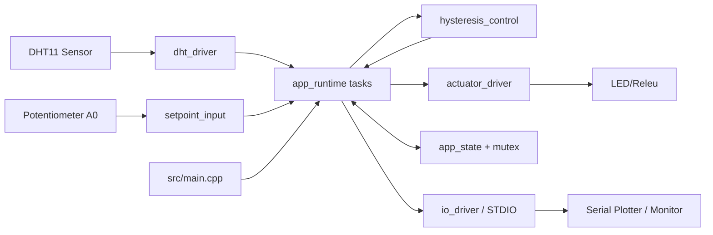
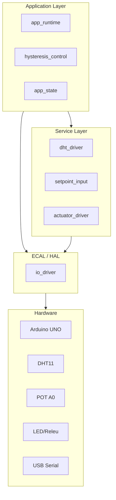
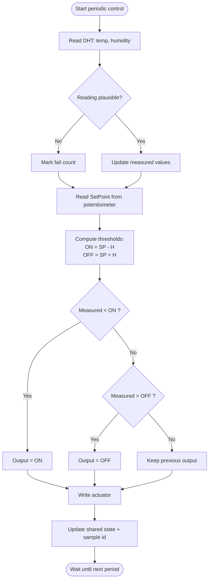
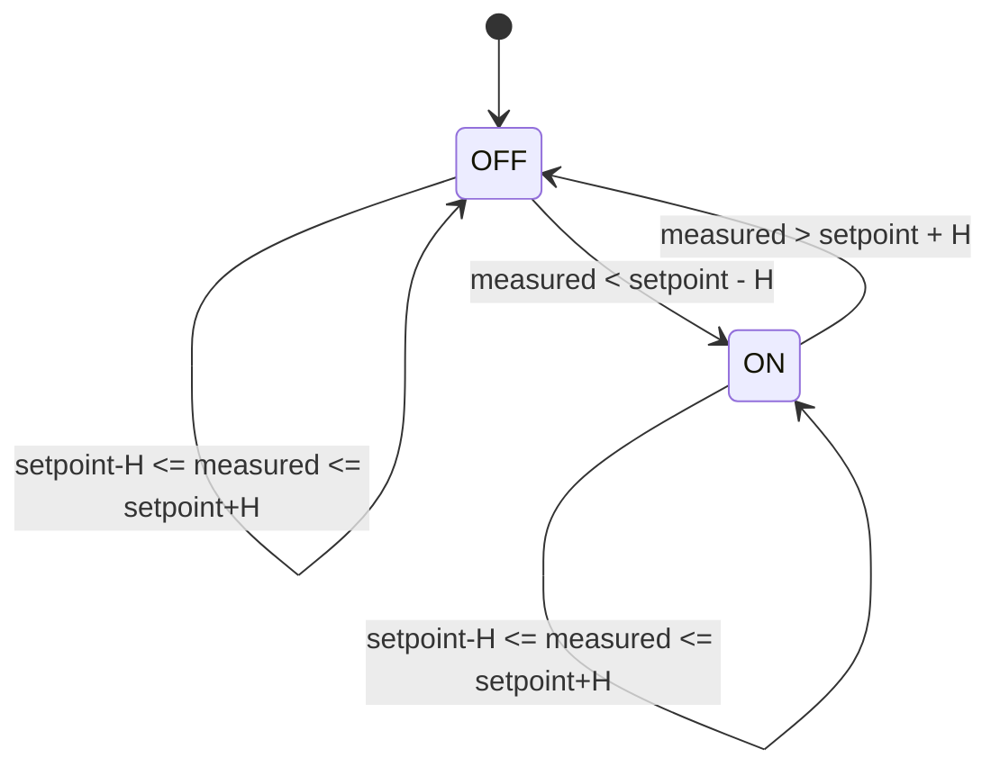
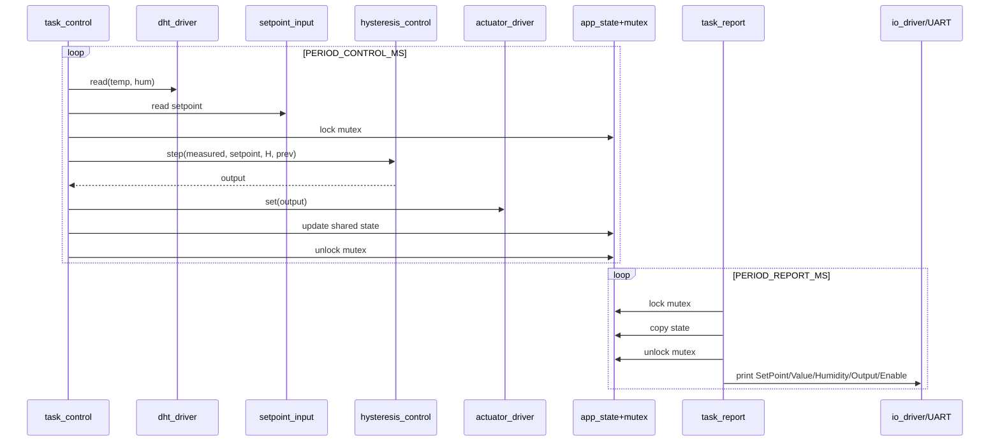

# Lab 6.2.1 ON-OFF cu histereza - Analiza + Diagrame

## 1) Verificare conformitate pe cerinte suplimentare

Stare actuala proiect (conform codului):

1. Modularizare (control, achizitie, actionare, IO): DA
2. Diagrame de control si flux de date: LIPSEAU in proiect, adaugate mai jos
3. Debouncing software pentru intrari digitale: PARTIAL
4. FreeRTOS taskuri separate pentru achizitie/control/actionare/afisare: PARTIAL
5. Sincronizare taskuri (mutex/semafor/coada): DA (mutex)
6. Afisare SetPoint/Value/Output/Enable pe STDIO: DA (Serial)
7. Reutilizare module, fara duplicari: DA
8. Testare scenarii/tranzitii: PARTIAL (nu era documentata)
9. Documentare arhitectura, interfete HW/SW, diagrame: PARTIAL (completata aici)
10. Monitorizare in timp real cu Serial Plotter: DA

Observatii cheie:

- Taskurile sunt 2 (control + report), nu 4 separate (acquire/control/actuate/display).
- Intrarea digitala exista in schema (switch), dar in varianta curenta este nefolosita in runtime.
- Pentru conformitate maxima la punctul FreeRTOS, se poate separa task_control in: task_acquire + task_control + task_actuate.

---

## 2) Diagrama structurala (A.1.4)

---

## 3) Arhitectura pe nivele HW-SW (A.1.4)

---

## 4) Diagrama de flux algoritm ON-OFF cu histereza (A.1.5)

---

## 5) Diagrama de stari pentru actuator (A.1.5)

---

## 6) Diagrama de secventa FreeRTOS (A.1.5)

---

## 7) Interfete HW/SW (pentru documentare)

- DHT11
  - HW: pin digital definit in config
  - SW: dht_driver_init, dht_driver_read

- Potentiometru
  - HW: A0
  - SW: setpoint_input_init, setpoint_input_read_c

- Actuator (LED/releu)
  - HW: pin digital output
  - SW: actuator_driver_init, actuator_driver_set

- STDIO serial
  - HW: UART USB
  - SW: io_uart_begin, io_printf, io_uart_print_report

---

## 8) Scenarii minime de test si criterii de validare (A.1.3/A.1.8)

1. Test histereza ON
- Conditie: Value < SetPoint - H
- Asteptat: Output=1, actuator ON

2. Test histereza OFF
- Conditie: Value > SetPoint + H
- Asteptat: Output=0, actuator OFF

3. Test banda moarta
- Conditie: SetPoint-H <= Value <= SetPoint+H
- Asteptat: Output pastreaza starea anterioara

4. Test variatie setpoint din potentiometru
- Conditie: rotire POT
- Asteptat: SetPoint in serial se modifica continuu in intervalul configurat

5. Test robustete DHT (fail)
- Conditie: intrerupere simulata citire
- Asteptat: warning periodic, sistemul continua executia taskurilor

6. Test concurenta taskuri
- Conditie: rulare 2+ minute
- Asteptat: fara blocari mutex, fara reset neasteptat

7. Test serial plotter
- Conditie: monitorizare in timp real
- Asteptat: apar seriile SetPoint, Value, Output, Enable

---

## 9) Recomandari pentru punctaj maxim

1. Separati explicit taskurile in 4: acquire, control, actuate, report.
2. Reintroduceti intrare digitala reala (switch) cu debouncing software activ.
3. Adaugati tabel de trasabilitate: cerinta -> test -> rezultat.
4. Adaugati capturi Plotter pentru minim 3 scenarii:
   - incalzire ON,
   - oprire OFF,
   - banda de histereza.
